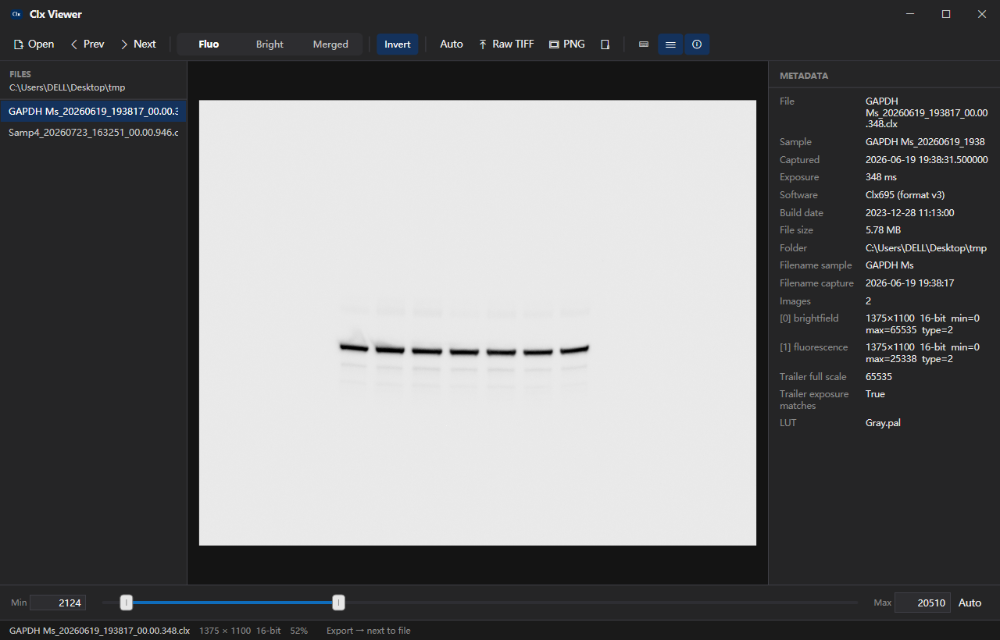

# Clx Viewer

> **English** | [简体中文](README.zh-CN.md)

A lightweight, fast Windows viewer for **Clinx `.clx` chemiluminescence
captures** — an in-app image viewer plus an Explorer thumbnail extension — all
built on the [`clxcpp`](https://github.com/WizardPanda/clinx_format_cpp) C++
parser, so exported image data stays **pixel-identical** to the instrument's
own files.



## Features

- **Open & navigate** `.clx` files — multi-select Open, folder file list,
  Prev/Next, drag & drop, double-click from Explorer, single-instance.
- **Three views**, switchable live:
  - **Fluo** — fluorescence, shown **reverted** by default (western-blot look).
  - **Bright** — brightfield (white film on a black board).
  - **Merged** — the fluorescence signal is **subtracted** from the brightfield,
    so bands appear as dark marks on the bright film; uses the un-reverted
    fluorescence with the same min/max as the reverted view.
- **Dual-thumb range slider** with an **Auto** button — min/max update the image
  in real time; the numeric boxes are editable too.
- **Auto min/max**, tuned for this data:
  - *Fluo:* the background renders as a clean light gray (~234/255) instead of
    blank white, while bands stay dark and crisp.
  - *Bright:* the film renders near 90% brightness so markers stay visible, even
    when the film only covers a small part of the frame.
- **Metadata panel** — sample name, capture time, exposure, software, build
  date, per-image descriptor, filename metadata and trailer info, on demand.
- **Exports** — pixel-identical 16-bit TIFFs and processed 8-bit PNGs (see
  [Export naming](#export-naming)), with a non-blocking success toast.
- **Zoom & pan** (wheel, drag, double-click to fit) and a raw pixel-value
  readout in the status bar.
- **Explorer thumbnails** — a native `IThumbnailProvider` renders the
  fluorescence preview with no extra badge.

## Requirements

- Windows 10/11 (x64)
- VS 2022 Build Tools (MSVC + CMake + Ninja)
- .NET 8 SDK (only needed to build; the self-contained installer bundles the runtime)
- The `clinx_format_cpp` submodule

## Install from a release

Prebuilt artifacts are attached to each [GitHub release](https://github.com/WizardPanda/clx_viewer/releases):

| Artifact | What it is |
|---|---|
| `*-fd-installer.exe` | Per-user installer; requires the .NET 8 Desktop Runtime (installs it automatically if missing) |
| `*-sc-installer.exe` | Per-user installer that bundles the .NET 8 runtime (no dependency) |
| `*-fd-portable.zip` | Portable folder; needs the .NET 8 Desktop Runtime |
| `*-sc-portable.zip` | Portable folder with the .NET 8 runtime bundled |
| `*-net48-installer.exe` | Per-user installer for the .NET Framework 4.8 variant (separate product, "Clx Viewer (Net48)") |
| `*-net48-portable.zip` | Portable folder for the .NET Framework 4.8 variant |

Installers register the Explorer thumbnail handler and the `.clx` file association
under the current user (no admin) and ship a proper uninstaller. Portable builds
register themselves automatically on the first normal launch (no script needed);
`ClxViewer.exe /register` and `ClxViewer.exe /unregister` (or the included
`register-portable.ps1` / `unregister-portable.ps1`) do it manually.

## Build from source

```powershell
git submodule update --init --recursive
.\tools\build.ps1          # native + WPF viewer; stages clxreader.dll next to the exe
.\viewer\bin\x64\Release\net8.0-windows\ClxViewer.exe  <capture.clx>
```

The viewer registers its thumbnail provider + `.clx` association automatically on
launch (per-user, no admin). `.\tools\register.ps1` / `.\tools\unregister.ps1` do
it manually if you prefer.

### Release artifacts (installers + portable zips)

```powershell
.\installer\prepare.ps1 -AppVersion 1.0.0   # builds FD/SC installers + portable zips into .\dist
```

### Build artifacts

| Artifact | Location |
|---|---|
| Viewer | `viewer\bin\x64\Release\net8.0-windows\ClxViewer.exe` |
| Native reader | `build-native\bin\clxreader.dll` (also copied next to the exe) |
| Thumbnail provider | `build-native\bin\ClinxThumbnailProvider.dll` |

## Keyboard shortcuts

| Shortcut | Action |
|---|---|
| `Ctrl+O` | Open `.clx` files |
| `Ctrl+E` | Export the current view as PNG |
| `Ctrl+Shift+E` | Export raw 16-bit TIFF(s) |
| `Alt+E` | Choose export folder |
| `←` / `→` | Previous / next file |
| `F` / `B` / `M` | Fluo / Bright / Merged view |
| `A` | Auto min/max |
| `I` | Invert fluo colors |
| `Ctrl+W` | Close |

(A keyboard-glyph button on the toolbar shows the same cheat sheet.)

## Export naming

- **Raw TIFF** — `<stem>_<i>_16bit.tif`, one per embedded image; always
  overwritten so there are no duplicates.
- **Processed PNG** — `<stem>_<view>_min<low>_max<high>.png`, where
  `view` is `fluo`, `bf` or `merged`.

Exports go next to the `.clx` file by default, or to a folder you choose
(`Alt+E`).

## Explorer thumbnail previews

`ClinxThumbnailProvider.dll` is an in-process COM `IThumbnailProvider` that
parses the `.clx` with `clxcpp` and renders the fluorescence channel with the
same auto levels as the viewer (transparent margins). It registers under
**HKCU** (current user, no admin rights) and draws no badge of its own, so
`.clx` behaves like a normal file type — Explorer applies its usual thumbnail
icon overlay per the global **"Display file icon on thumbnails"** folder option.

## Repository layout

```
native/clxreader/       C-ABI DLL over clxcpp (clxreader.dll)
native/shellext/        COM IThumbnailProvider (ClinxThumbnailProvider.dll)
third_party/clinx_format_cpp/   clxcpp parser (git submodule)
viewer/                 .NET 8 WPF application
tools/                  build / register / unregister / refresh-thumbnails / icon / screenshot scripts
assets/                 brand icon
docs/                   screenshot
```

The parser is pulled in as a git submodule and referenced via CMake
`add_subdirectory`, so exported pixels stay byte-identical to the instrument's
TIFFs.

## License

**GNU Affero General Public License v3 (AGPL-3.0-or-later)** — see [LICENSE](LICENSE)
and [NOTICE](NOTICE).

The `.clx` parser (`clinx_format_cpp` submodule) is MIT-licensed and miniz is
public domain; both are AGPL-compatible and their notices are preserved.

## Notes

- **Thumbnail cache**: after first registration Explorer may keep showing
  generic icons until the cache is refreshed — run
  `.\tools\refresh-thumbnails.ps1` or navigate away and back in the folder.
- **Auto-level constants** live in `viewer/Services/AutoLevels.cs` and are
  mirrored in `native/shellext/thumbnail_provider.cpp` — keep them in sync.
- **Headless export** (used by build checks):
  `ClxViewer.exe --selftest-export <outdir> <file.clx>` exports raw TIFFs and
  all three views without showing the window.
- The `.clx` format is reverse-engineered (see `clinx_format_cpp/docs`); it is
  validated against real instrument samples in the clxcpp test suite.
